# **Traffic Sign Recognition** 

---

**Build a Traffic Sign Recognition Project**

The goal of this project is to build a classifier capable of recognizing german traffic signals. 

The steps taken to achieve this goal were:

* Explore, summarize and visualize the data set
* Design, train and test a model architecture
* Use the model to make predictions on new images

[//]: # (Image References)

[image1]: ./examples/visualization.jpg "Visualization"
[image2]: ./examples/grayscale.jpg "Grayscaling"
[image3]: ./examples/random_noise.jpg "Random Noise"
[image4]: ./examples/placeholder.png "Traffic Sign 1"
[image5]: ./examples/placeholder.png "Traffic Sign 2"
[image6]: ./examples/placeholder.png "Traffic Sign 3"
[image7]: ./examples/placeholder.png "Traffic Sign 4"
[image8]: ./examples/placeholder.png "Traffic Sign 5"
[sign_samples]: ./images/sign_samples.png "Sign samples"
[class_frequency]: ./images/class_frequency.png "Class Frequency"
[mean_pixel_value]: ./images/mean_pixel_value.png "Mean pixel value"
[before_after]: ./images/before_after.png "Before and after equalization"

## Data Set Summary & Exploration

Some summary statistics of the traffic
signs data set:

* Number of training examples = 34799
* Number of validation examples = 4410
* Number of testing examples = 12630
* Image data shape = (32, 32, 3)
* Number of classes = 43

Here are some random samples of each class, including the number of samples per class, visualized using the matplotlib library:
![alt text][sign_samples]

Some classes have much more examples than others (10 times more "Speed limit 30 than 20, for example), and some of the random samples look very dark. 

Lets see a graphical representation of the frequency of different classes. We'll do it for the three sets of images, to check they have a similar distribution:

![alt text][class_frequency]

It looks like the distribution is roughly the same. Even the most rare classes have at least a hundred examples. Will that be enough to train a reliable classifier? 

### Model Architecture Design and Test

#### 1. Image data preprocessing

As a first step, I decided to equalize image data, to compensate for different lightning conditions.  I tried different approaches, as converting the images to HSV and equalizing only the luminosity, but the best performance was achieved equalizing each channel independently. 

Here is an example of a traffic sign image before and after the process, with the histogram for each channel.

![alt text][before_after]

After this, data was normalized to a N(0,1) distribution, where the NN works best.

#### 1.1. Data augmentation

Additional samples were generated for those classes that were harder to classify (see section 4). 
For each class to be augmented, 6 additional samples were generated: 2 moved (1 to 3 pixels) 2 rotated (-15 to 15 degrees) and 2 warped (random deformations pulling or pushing each corner -5 to 5 pixels). If the class was "flippable", that is, if mirroring it horizontally it was still meaningful, those flipped samples were added to the set, and 6 samples from each were generated.

Here is an example of the kind of transformations that were used. This selection includes all "flippable" classes, so that all transformations could be shown, but in the final model only one of those classes was reinforced with additional samples.

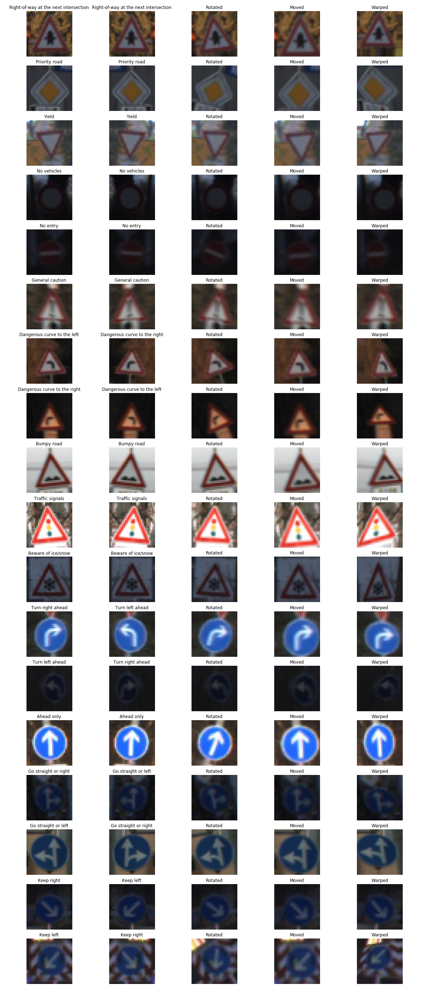

The final augmented set contains 85,679 samples with the following distribution:
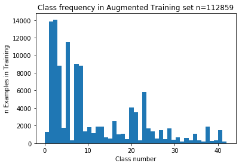

 even more unbalanced than the provided set. Generating more examples for the less frequent classes was tried, but unsuccessful (refer to section 4 for more details on the process).

#### 2. Final Model architecture

The final model consisted of the following layers:

| Layer         		|     Description	        					| 
|:---------------------:|:---------------------------------------------:| 
| Input         		| 32x32x3 RGB image   							| 
| Convolution 3x3     	| 1x1 stride, valid padding, outputs 30x30x18 |
| RELU					|						|
| Max pooling	 2x2      	| 2x2 stride,  outputs 15x15x18 |
| Convolution 3x3	    | 1x1 stride, valid padding, outputs 13x13x48 |
| RELU					|						|
| Max pooling	 2x2     	| 2x2 stride,  outputs 6x6x48 |
| Convolution 3x3	    | 1x1 stride, valid padding, outputs 4x4x96 |
| RELU					|						|
|Dropout| |
| Fully connected		| 360 units        |
| Fully connected		| 150 units        |
| Dropout | |
| Fully connected		| 43 units        |
| Softmax				| |

 

#### 3. Model training.

To train the model, I used an Adam Optimizer, with cross entropy as the loss function and learning rate 0.0005 and default beta and epsilon parameters (0.9 exponential decay for the first moment, 0.999 for the second moment and 10e-8 epsilon).
40 epochs were run for the final model with mini-batches of size 128. 

#### 4. Classifier optimization

My final model results were:

* training set accuracy of 1.0
* validation set accuracy of 0.992
* test set accuracy of 0.966

If an iterative approach was applied:

* The starting point was the LeNet architecture, as it was successful with a similar problem.
* The initial accuracy was not considered to be high enough, so an additional convolution layer was added, and additional channels were added to the existing ones.
* Overfitting to the training set was a problem soon, so first L2 regularization and later dropout were added to the model. Regularization was not very effective, and dropout was finally applied twice, before the first fully connected layer, and before the last fully connected layer. Half the activations were dropped in each case (during the training phase). 
* With this approach, I reached a validations set accuracy of 0.981, but I tought a better performance could be achieved.
* I tried data augmentation, balancing the class frequency on the training set, different techniques to convert the input images to grayscale  and alternative model structures, with shortcuts from the first convolutional layers to the fully connected ones, as succesfully implemented in [Sermanet, P., & LeCun, Y. (2011). Traffic sign recognition with multi-scale Convolutional Networks. Ijcnn.](http://yann.lecun.com/exdb/publis/pdf/sermanet-ijcnn-11.pdf), with the layer sizes described in the paper. However, none of this attempts had an accuracy over 0.950, so I decided to go back to the original model and try small improvements.
* I used an iterative model, each time I ran the model, I looked the classes where the model was failing in the validation set. This was the table for the first model (the one with accuracy 0.981):

|  Class number | errors/total | pct error  | Class label  | 
|---------------|--------------|------------|----------------|                                      
           1 |         7/30 |     23.33% | Speed limit (20km/h)   |                             
             2 |        4/240 |      1.67% | Speed limit (30km/h)                                
             3 |        4/240 |      1.67% | Speed limit (50km/h)                                
             4 |        6/150 |      4.00% | Speed limit (60km/h)                                
             6 |        4/210 |      1.90% | Speed limit (80km/h)                                
             9 |        4/150 |      2.67% | Speed limit (120km/h)                               
            16 |         2/90 |      2.22% | No vehicles                                         
            21 |        11/60 |     18.33% | Dangerous curve to the right                        
            22 |        10/60 |     16.67% | Double curve                                        
            24 |         3/60 |      5.00% | Slippery road                                       
            25 |         9/30 |     30.00% | Road narrows on the right                           
            28 |         7/30 |     23.33% | Pedestrians                                         
            30 |         1/30 |      3.33% | Bicycles crossing                                   
            31 |         1/60 |      1.67% | Beware of ice/snow                                  
            32 |         1/90 |      1.11% | Wild animals crossing                               
            42 |         4/30 |     13.33% | End of no passing                                   
            43 |         3/30 |     10.00% | End of no passing by vehicles over 3.5 metric tons  

Using this information, I applied data augmentation just to the classes where the classifier was having difficulties. In this case, classes 25, 1 and 28 (the first class is 1, not 0).

This process was repeated while the classifier kept improving the performance on the validation set to reach the final performance of 0.992. This is the error table for the final classifier:

 Class number | errors/total | pct error  | Class label                                         
|---------------|--------------|------------|----------------| 
  1 |         1/30 |      3.33% | Speed limit (20km/h)                                
             2 |        4/240 |      1.67% | Speed limit (30km/h)                                
             9 |        8/150 |      5.33% | Speed limit (120km/h)                               
            19 |        2/120 |      1.67% | General caution                                     
            21 |         6/60 |     10.00% | Dangerous curve to the right                        
            22 |         5/60 |      8.33% | Double curve                                        
            24 |         3/60 |      5.00% | Slippery road                                       
            27 |         1/60 |      1.67% | Traffic signals                                     
            29 |         1/60 |      1.67% | Children crossing                                   
            31 |         1/60 |      1.67% | Beware of ice/snow                                  

And these are some of the specific images the classifier was having trouble with:

Missclassified in class Dangerous curve to the right
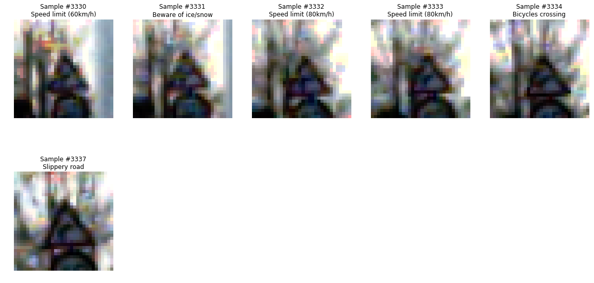
Missclassified in class Speed limit (120km/h)
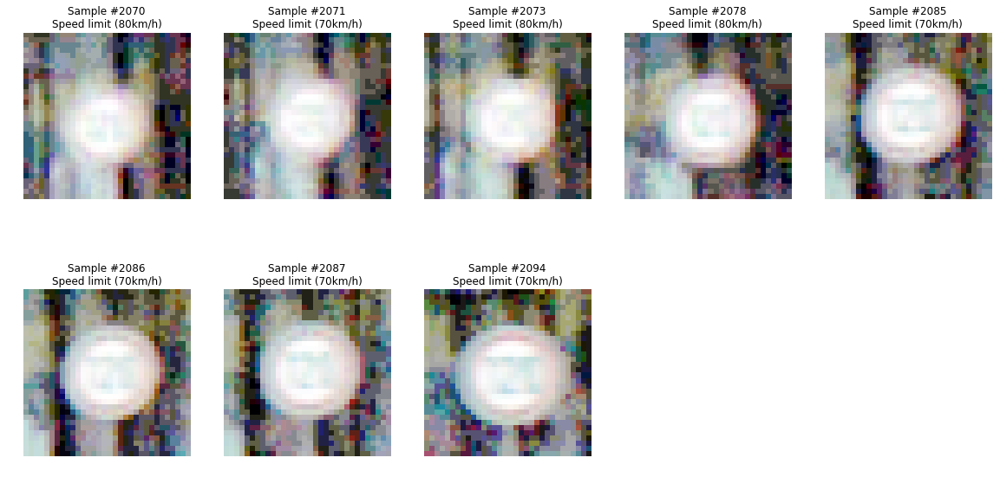
Missclassified in class Double curve
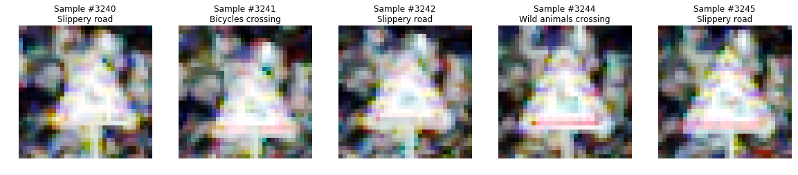
Missclassified in class Speed limit (30km/h)
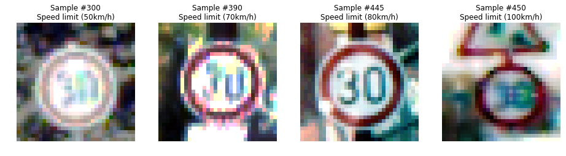

### Test a Model on New Images

#### 1. German Traffic signs from the web

Accuracy in the test set was acceptable, but all images in the test come from the same source as the training images (as should be, as we are interested in classifing images from a particular camera position). However, I decided to test the classifier with images from different sources. Here are five German traffic signs that I found on the web (in some cases, cropped from a more general photo):

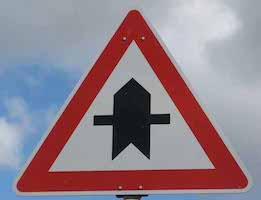 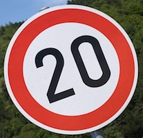
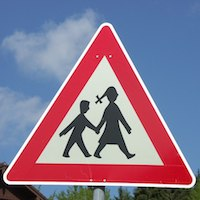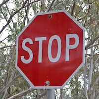![]

Number two and five might be the most challenging, as one is rotated and the other a bit skewed. All of them are taken in excellent conditions.
Here's how they look when resized to 32x32:
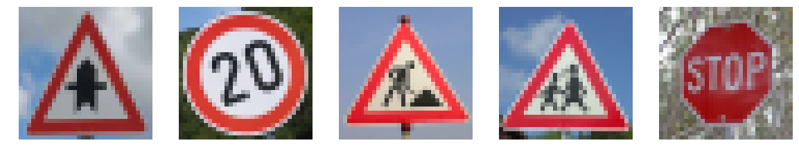

#### 2. Discuss the model's predictions on these new traffic signs and compare the results to predicting on the test set.

Here are the results of the prediction:

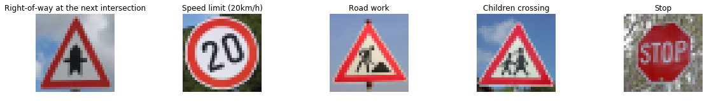

The model was able to correctly guess all test signs! This aligns with expectation, as the the model had a test set accuracy of 0.966. We have to also take into account that all these images are from signs with very good lightning conditions, so it's possible it works even better than in the test set. However, it's not possible to draw much conclusions from such a small set of images.

Let's see how certain the model was of these predictions, using the 'top_k' function from tensorflow. 

The classifier was very certain of the guess for 3 of the signals (p~1), and also quite sure about the other two (p=0.97, and p=0.83) 

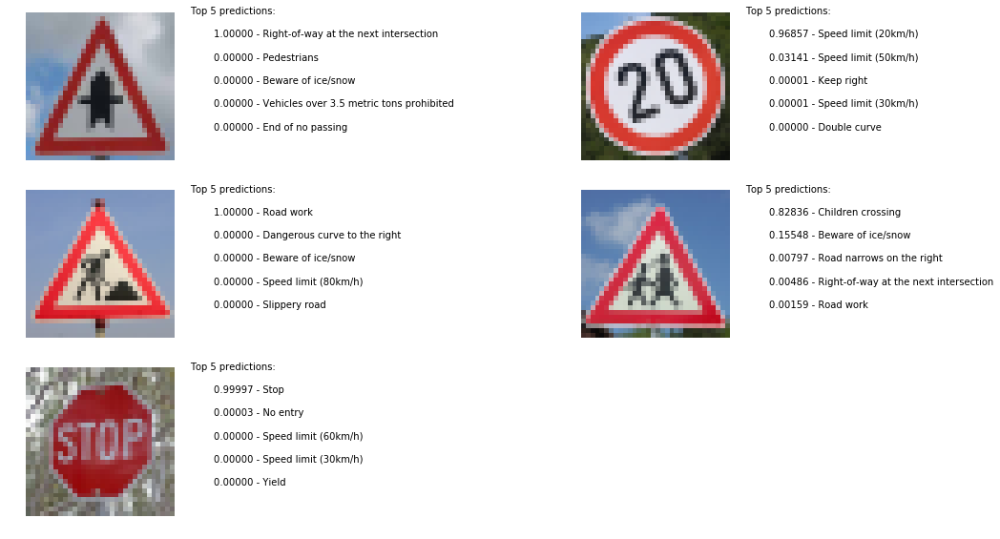

---

This project was completed for the Udacity Self Driving Car Nanodegree 
