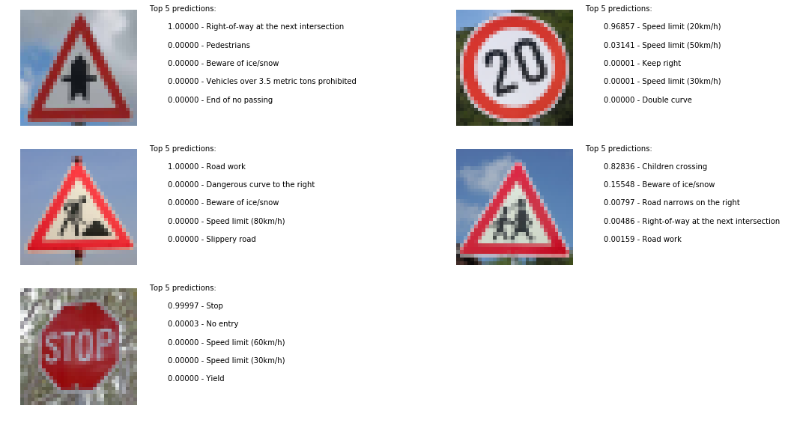

# **Traffic Sign Recognition** 

## Writeup

### You can use this file as a template for your writeup if you want to submit it as a markdown file, but feel free to use some other method and submit a pdf if you prefer.

---

**Build a Traffic Sign Recognition Project**

The goals / steps of this project are the following:
* Load the data set (see below for links to the project data set)
* Explore, summarize and visualize the data set
* Design, train and test a model architecture
* Use the model to make predictions on new images
* Analyze the softmax probabilities of the new images
* Summarize the results with a written report

[//]: # (Image References)

[image1]: ./examples/visualization.jpg "Visualization"
[image2]: ./examples/grayscale.jpg "Grayscaling"
[image3]: ./examples/random_noise.jpg "Random Noise"
[image4]: ./examples/placeholder.png "Traffic Sign 1"
[image5]: ./examples/placeholder.png "Traffic Sign 2"
[image6]: ./examples/placeholder.png "Traffic Sign 3"
[image7]: ./examples/placeholder.png "Traffic Sign 4"
[image8]: ./examples/placeholder.png "Traffic Sign 5"
[sign_samples]: ./images/sign_samples.png "Sign samples"
[class_frequency]: ./images/class_frequency.png "Class Frequency"
[mean_pixel_value]: ./images/mean_pixel_value.png "Mean pixel value"
[before_after]: ./images/before_after.png "Before and after equalization"

[]: ./images/.png ""

## Rubric Points
### Here I will consider the [rubric points](https://review.udacity.com/#!/rubrics/481/view) individually and describe how I addressed each point in my implementation.  

---
### Writeup / README

#### 1. Provide a Writeup / README that includes all the rubric points and how you addressed each one. You can submit your writeup as markdown or pdf. You can use this template as a guide for writing the report. The submission includes the project code.

You're reading it! and here is a link to my [project code](https://github.com/NachoCM/CarND-Traffic-Sign-Classifier/blob/master/Traffic_Sign_Classifier.ipynb)

### Data Set Summary & Exploration

#### 1. Provide a basic summary of the data set. In the code, the analysis should be done using python, numpy and/or pandas methods rather than hardcoding results manually.

I used the vanilla python to calculate summary statistics of the traffic
signs data set:

* Number of training examples = 34799
* Number of validation examples = 4410
* Number of testing examples = 12630
* Image data shape = (32, 32, 3)
* Number of classes = 43

I then used the matplotlib library to visualize some random samples of each class, including the number of samples per class:
![alt text][sign_samples]

Some classes have much more examples than others (10 times more "Speed limit 30 than 20, for example), and some of the random samples look very dark. 

#### 2. Include an exploratory visualization of the dataset.

Lets see a graphical representation of the frequency of different classes. We'll do it for the three sets of images, to check they have a similar distribution:

![alt text][class_frequency]

It looks like the distribution is roughly the same. Even the most rare classes have at least a hundred examples. Will that be enough to train a reliable classifier? 

### Design and Test a Model Architecture

#### 1. Image data preprocessing

As a first step, I decided to equalize image data, to compensate for different lightning conditions.  I tried different approaches, as converting the images to HSV and equalizing only the luminosity, but the best performance was achieved equalizing each channel independently. 

Here is an example of a traffic sign image before and after the process, with the histogram for each channel.

![alt text][before_after]

After this, data was normalized to a N(0,1) distribution, where the NN works best.

#### 2. Describe final model architecture

My final model consisted of the following layers:

| Layer         		|     Description	        					| 
|:---------------------:|:---------------------------------------------:| 
| Input         		| 32x32x3 RGB image   							| 
| Convolution 3x3     	| 1x1 stride, valid padding, outputs 30x30x18 |
| RELU					|						|
| Max pooling	 2x2      	| 2x2 stride,  outputs 15x15x18 |
| Convolution 3x3	    | 1x1 stride, valid padding, outputs 13x13x48 |
| RELU					|						|
| Max pooling	 2x2     	| 2x2 stride,  outputs 7x7x96 |
| Convolution 3x3	    | 1x1 stride, valid padding, outputs 5x5x48 |
| RELU					|						|
|Dropout| |
| Fully connected		| 360 units        |
| Fully connected		| 150 units        |
| Dropout | |
| Fully connected		| 43 units        |
| Softmax				| |

 

#### 3. Describe how you trained your model.

To train the model, I used an Adam Optimizer, with cross entropy as the loss function and learning rate 0.0005 and default beta and epsilon parameters (0.9 exponential decay for the first moment, 0.999 for the second moment and 10e-8 epsilon).
20 epochs were run for the final model with mini-batches of size 128. During model development, up to 100 epochs were tested with variants of the model, but the accuracy did not improve after about 20 epochs. , altough a higher number was tested while tuning the model. 

#### 4. Describe the approach taken for finding a solution and getting the validation set accuracy to be at least 0.93.

My final model results were:

* training set accuracy of 1.0
* validation set accuracy of 0.983
* test set accuracy of 0.966

If an iterative approach was applied:

* The starting point was the LeNet architecture, as it was successful with a similar problem.
* The initial accuracy was not considered to be high enough, so an additional convolution layer was added, and additional channels were added to the existing ones.
* Overfitting was a problem soon, so first L2 regularization and later dropout were added to the model. Regularization was not very effective, and dropout was finally applied twice, before the first fully connected layer, and before the last fully connected layer. Half the activations were dropped in each case (during the training phase). 
* Which parameters were tuned? How were they adjusted and why?
* What are some of the important design choices and why were they chosen? For example, why might a convolution layer work well with this problem? How might a dropout layer help with creating a successful model?

In order to determine what kind of errors the classifier was making, I looked at the accuracy for each class, as can be seen in the following table (classes with no errors were not included):

|  Class number | errors/total | pct error  | Class label    |                                     
|---------------|--------------|------------|----------------|
             1 |         5/30 |     16.67% | Speed limit (20km/h) |                               
             2 |        3/240 |      1.25% | Speed limit (30km/h)                                
             3 |        8/240 |      3.33% | Speed limit (50km/h)                                
             6 |        3/210 |      1.43% | Speed limit (80km/h)                                
             9 |        3/150 |      2.00% | Speed limit (120km/h)                               
            16 |         1/90 |      1.11% | No vehicles                                         
            21 |        10/60 |     16.67% | Dangerous curve to the right                        
            22 |        14/60 |     23.33% | Double curve                                        
            24 |         2/60 |      3.33% | Slippery road                                       
            25 |        11/30 |     36.67% | Road narrows on the right                           
            26 |        2/150 |      1.33% | Road work                                           
            28 |         7/30 |     23.33% | Pedestrians                                         
            30 |         1/30 |      3.33% | Bicycles crossing                                   
            31 |         3/60 |      5.00% | Beware of ice/snow                                  
            42 |         1/30 |      3.33% | End of no passing                                   

While more than half of the signs could be identified perfectly in the validation set, there are clearly a few problematic cases. Let's look at specific examples:
For the worst performing class, 'Road narrows on the right':

We can see it often gets confused with a 'General caution' sign, and looking at the samples it can be seen that the 'narrowing' part is difficult to see at this resolution. 

The next two problematic cases are 'Double curve' and 'Pedestrians'

Apart from the problems the classifier seems to have with caution signs, the signs in this first row are difficult to read even for a human, it seems the images for this class are for some reason of a lower quality. 

Many of these pedestrian signs are confused with 'Road narrows to the right' signs (the worst performing class). It seems the classifier is having problems identifying the defining characteristics of that one.

### Test a Model on New Images

#### 1. German Traffic signs from the web

Here are ten German traffic signs that I found on the web (in some cases, cropped from a more general photo):

 

The last three might be the most challenging, as two of them are slightly rotated. The third is not even from Germany, but is quite similar to a Speed Limit sign, so I was curious on what might happen. I've found 'children crossing' signs with the kids facing right and left, so I included both, also out of curiosity. 

#### 2. Discuss the model's predictions on these new traffic signs and compare the results to predicting on the test set.

Here are the results of the prediction:

The model was able to correctly guess 6 of the 10 traffic signs, which gives an accuracy of 60%. If we ignore the result for the foreign sign, the accuracy would go up to 66.6%, still quite far from the 96.6% accuracy obtained in the test set. 

Surprisingly, the last image ('Dangerous curve to the right'), gets identified as a No entry sign, which has a round shape. It seems the classifier is not even correctly identifying the overall shape of the sign. 

#### 3. Describe how certain the model is when predicting on each of the new images by looking at the softmax probabilities for each prediction.

The code for making predictions on my final model is located in the 'Error Analysis' section of the Ipython notebook, but in this case we wanted probabilities for the top 5 classes, so a custom run was required using the 'top_k' function from tensorflow. 

The classifier very certain of all the signals he got right, with all predictions over 99% confidence. The probability for the foreing sign is also very high, but mistaken, but we were cheating on this one, so looking at the genuine mistakes, altough the classifier is not very good with this set, it seems to know it, with all misclassifications below 50% confidence. 

### (Optional) Visualizing the Neural Network (See Step 4 of the Ipython notebook for more details)
#### 1. Discuss the visual output of your trained network's feature maps. What characteristics did the neural network use to make classifications?

